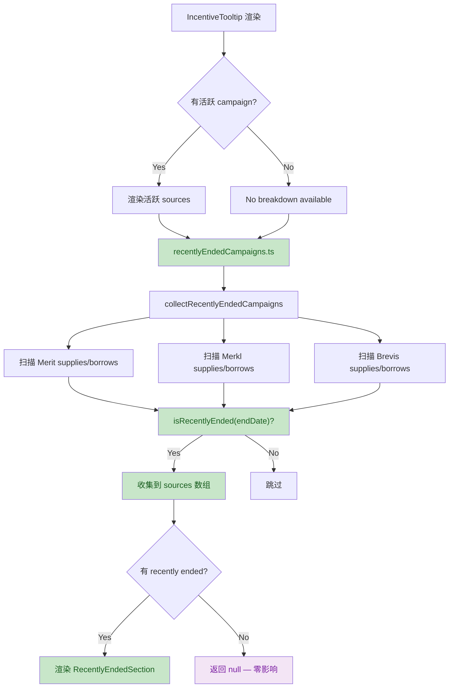
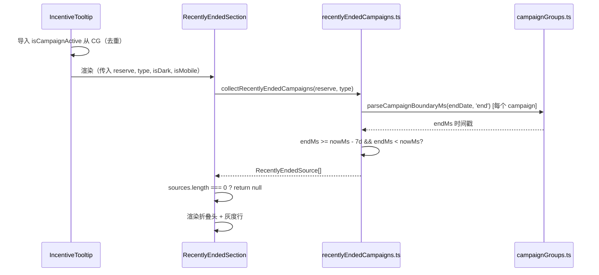

# Recently Ended Campaigns — 设计文档

**日期**: 2026-05-15（更新 2026-05-29）
**状态**: ✅ 已实现
**关联文档**: `docs/backend/change-detection-and-incentive-normalization.md`（后端 repo `aave-protocol-analysis`）

---

## 1. 动机

用户在 IncentiveTooltip 中查看当前活跃的激励活动时，如果某个 reserve 上刚好有活动在近期结束，用户完全不知情。在 tooltip 底部展示近期刚结束的活动，可以让用户：

- 感知「刚错过的机会」，对未来的活动更加关注
- 理解 APY 变动的原因（活动结束 → APY 下降）
- 快速找到已结束活动的详情页链接

---

## 2. 现状

### 2.1 数据流

```
后端 GET /markets（无时间参数）
  ├── 活跃 campaign：全量发送
  └── 过期 campaign：按 (opportunity, campaignType) 去重，只保留最近一条过期
       ↓
前端 Zod 解析（MeritIncentive / MerklCampaignBreakdown / BrevisIncentive）
       ↓
isCampaignActive(startDate, endDate, Date.now()) → 只保留 nowMs <= endMs
       ↓
APY 汇总 / IncentiveTooltip 渲染 / 模拟面板 → 只展示活跃的
  └── 过期数据被丢弃（本功能将利用这些数据）
```

### 2.1a 后端数据契约

后端 `change-detection-and-incentive-normalization.md` 定义了过期数据范围：

- **数据范围**：Merkl LIVE opportunities 中的过期 campaign，按 `(opportunity, campaignType)` 去重，只保留最近一条过期（121 → ~25 条）
- **APY 排除**：后端 `sum()` 时排除过期条目（`endDate < now`）
- **Merit / Brevis**：同理，保留最近一条过期的 round/campaign

前端收到的过期数据是**精选过的**（每个来源类型只保留最近一条过期），不是全量。

### 2.2 当前过滤位置（7 处）

| 文件 | 作用 |
|------|------|
| `formatters.ts` — `sumMeritIncentives` / `sumMerklOpportunities` / `sumBrevisIncentives` | 过期不计入 Composite APY |
| `IncentiveTooltip.tsx` — `renderSourceCampaigns` Merit / Brevis 分支 | 过期不渲染 |
| `useRateSimulation.ts` — Merit 过滤 + `simulationCampaignDetails` 过滤 | 过期不参与模拟 |
| `merklCampaigns.ts` — `collectMerklCampaignOptions` | 过期不收集到选项列表 |
| `campaignGroups.ts` — `isCampaignActive()` | 通用过滤函数 |

### 2.3 三种激励类型的时间字段

| 类型 | 开始字段 | 结束字段 | 日期格式 |
|------|----------|----------|----------|
| Merit | `startDate` | `endDate` | `"2026-02-26"`（仅日期） |
| Merkl breakdown | `campaignStartedAt` | `campaignEndedAt` | `"2026-03-24T14:00:00.000Z"`（ISO） |
| Brevis | `campaignStartedAt` | `campaignEndedAt` | `"2025-08-13T13:00:00.000Z"`（ISO） |

### 2.4 `isCampaignActive()` 核心逻辑

```typescript
// campaignGroups.ts
export const isCampaignActive = (startDate, endDate, nowMs = Date.now(), allowOpenEnd = false) => {
  const startMs = parseCampaignBoundaryMs(startDate, 'start');
  if (startMs === null || nowMs < startMs) return false;
  const endMs = parseCampaignBoundaryMs(endDate, 'end');
  if (endMs === null) return allowOpenEnd;
  return nowMs <= endMs;
};
```

---

## 3. 设计方案

### 3.1 放置位置：IncentiveTooltip 底部

在桌面端浮层 / 移动端 BottomSheet 中，所有活跃 source row 渲染完毕后，底部追加一个 **可折叠的「Recently Ended」区块**。

**选择理由**：
- 上下文最强 — 用户正在看「这个 reserve 有什么激励」，顺势看到刚结束的
- 不占用主页面空间，不打扰正常浏览
- 过期数据已在同一 reserve 对象中，无需额外请求
- 复用 IncentiveSourceRow 结构，降低实现成本

### 3.2 时间阈值

默认展示 **过去 7 天**内结束的 campaign。

直接用 `endDate` / `campaignEndedAt` 判断：`endMs >= nowMs - 7 * 86400000 && endMs < nowMs`。

`_isExpired` 是后端序列化时的辅助标记，前端已有 `endDate` 可直接判断，不需依赖该字段。

阈值写为组件常量，后续可调。

### 3.3 视觉设计

#### 3.3.1 折叠头

```
┌─────────────────────────────────────────────────────┐
│   📋 Recently Ended (2)                      ▾      │
└─────────────────────────────────────────────────────┘
```

- 字号：`ds-tooltip-body`（12px）
- 颜色：`text-muted-foreground`
- 左侧小图标：`History` 或 `Clock`（lucide-react）
- 右侧 chevron：展开时旋转 180°
- 分割线：`border-t border-border/30`（比活跃区域淡一个层级）
- 点击整行展开/折叠

#### 3.3.2 过期行（展开后）

展示结构与活跃 `IncentiveSourceRow` 一致，但做视觉弱化：

| 元素 | 活跃样式 | 过期样式 |
|------|----------|----------|
| Logo | 正常色 + `ring-1 ring-border/50` | `grayscale(100%)` + `opacity-50` |
| Source 名称 | `ds-tooltip-title text-foreground` | `ds-tooltip-title text-zinc-400` |
| 外链按钮 | 正常色 `h-7 w-7` | `opacity-40` |
| 百分比数值 | `ds-tooltip-title` accent 色 | `ds-tooltip-title text-zinc-500` |
| 时间文字 | `ds-tooltip-body text-muted-foreground` | `ds-tooltip-body text-zinc-400` |
| 左侧 accent 边框 | emerald-500 / cyan | **无**（或在过期区域统一用 `border-l-zinc-300`） |
| 消息/breakdowns | 灰色圆点 + 消息文本 | 压低到 `text-zinc-400` |

#### 3.3.3 左边界颜色处理

过期区域不使用 supply=emerald / borrow=cyan 的 accent 左边界。两种选择：

- **方案 A**：过期区域无左边界颜色（更干净）
- **方案 B**：过期区域统一用 `border-l-zinc-300`（与活跃区域区分）

推荐 **方案 A**，因为折叠头已有 `border-t` 分割线，视觉上已足够区分。

#### 3.3.4 动画

- 桌面端：折叠展开用 `animate-in fade-in slide-in-from-top-1 duration-150`
- 行级不设错开动画（过期内容不需要吸引力）
- 移动端：无动画

#### 3.3.5 空状态

如果 7 天内没有任何已结束 campaign，**不渲染任何内容**，tooltip 保持原样。

---

## 4. 实现计划

### 4.1 新增文件

| 文件 | 用途 |
|------|------|
| `src/lib/recentlyEndedCampaigns.ts` | 从 reserve 数据中提取近期过期 campaign 的纯函数 |
| `src/lib/recentlyEndedCampaigns.test.ts` | 对应单测（边界条件：7天阈值、无过期、混合活跃过期） |

### 4.2 修改文件

| 文件 | 改动 |
|------|------|
| `src/components/dashboard/IncentiveTooltip.tsx` | 在 `orderedIncentiveSources` 渲染完毕后追加「Recently Ended」折叠区块 |
| `src/components/dashboard/IncentiveTooltip.test.tsx` | 新增 test case：有过期 campaign 时展示折叠区、无过期时隐藏、点击展开/折叠 |

### 4.3 不修改的文件

- `formatters.ts` — APY 计算逻辑不变，只算活跃的
- `useRateSimulation.ts` — 模拟面板不变
- `campaignGroups.ts` — `isCampaignActive()` 不变，新增 `isRecentlyEnded()` 放 `recentlyEndedCampaigns.ts`

---

## 5. 核心函数设计

### 5.1 `isRecentlyEnded(endDate, nowMs?, lookbackDays?)` — `src/lib/recentlyEndedCampaigns.ts`

```typescript
const DEFAULT_LOOKBACK_DAYS = 7;

export function isRecentlyEnded(
  endDate: string | undefined,
  nowMs: number = Date.now(),
  lookbackDays: number = DEFAULT_LOOKBACK_DAYS,
): boolean {
  const endMs = parseCampaignBoundaryMs(endDate, 'end');
  if (endMs === null) return false;
  const thresholdMs = nowMs - lookbackDays * 86400000;
  return endMs >= thresholdMs && endMs < nowMs;
}
```

### 5.2 `collectRecentlyEndedCampaigns(reserve, nowMs?, lookbackDays?)` — 同上文件

输入一个 `ReserveWithSpread`，返回按 source 分组的近期过期 campaign 列表。

```typescript
interface RecentlyEndedSource {
  sourceType: 'merit' | 'merkl' | 'brevis';
  sourceName: string;
  link: string;
  campaigns: RecentlyEndedCampaign[];
}

export function collectRecentlyEndedCampaigns(
  reserve: ReserveWithSpread,
  nowMs?: number,
  lookbackDays?: number,
): RecentlyEndedSource[];
```

内部按 Merit / Merkl breakdowns / Brevis breakdowns 三类分别过滤：
- Merit：取 `reserve.meritSupplys` / `reserve.meritBorrows`，用 `endDate` 判断
- Merkl：遍历 group，过滤 breakdowns，用 `campaignEndedAt` 判断
- Brevis：遍历 incentives，过滤 breakdowns，用 `campaignEndedAt` 判断

---

## 6. IncentiveTooltip 组件改动

### 6.1 新增子组件 `RecentlyEndedSection`

```tsx
// 内部组件，不导出
function RecentlyEndedSection({ reserve, supplyOrBorrow }: {
  reserve: ReserveWithSpread;
  supplyOrBorrow: 'supply' | 'borrow';
}) {
  const [expanded, setExpanded] = useState(false);
  const sources = collectRecentlyEndedCampaigns(reserve);
  if (sources.length === 0) return null;

  return (
    <>
      <button onClick={() => setExpanded(!expanded)} className="...">
        <ClockIcon />
        <span>Recently Ended ({sources.length})</span>
        <ChevronIcon rotated={expanded} />
      </button>
      {expanded && (
        <div className="animate-in fade-in slide-in-from-top-1 duration-150">
          {sources.map(source => (
            <RecentlyEndedSourceRow key={source.sourceType} source={source} />
          ))}
        </div>
      )}
    </>
  );
}
```

### 6.2 渲染位置

在 `orderedIncentiveSources.map()` 渲染完毕后，`</div>`（`divide-y` 容器）**之后**插入 `<RecentlyEndedSection>`（不在 `divide-y` 容器内，用独立的 `border-t` 分割线）。

`hasDetails` 条件放宽为 `hasDetails || hasRecentlyEnded`，确保无活跃 campaign 但有 recently ended 时也渲染 accent-border 区块。

### 6.3 业务数据流



### 6.4 技术调用序列



---

## 7. 边界情况

| 场景 | 行为 |
|------|------|
| 无近期过期 campaign | `RecentlyEndedSection` 返回 `null`，tooltip 无变化 |
| 过期但超出 7 天 | 不收集，不展示 |
| 只有 Merit 过期 | 只展示 Merit 行 |
| Merkl 白名单 excluded 的过期 campaign | 同样展示，因为历史值有参考意义 |
| 结束日期缺失（`endDate === undefined`） | `isRecentlyEnded` 返回 `false` |
| 未来结束日期（未来活动） | `endMs >= nowMs`，不满足 `endMs < nowMs`，排除 |
| 移动端 BottomSheet | 同样渲染，无动画 |

---

## 8. 性能考量

- `collectRecentlyEndedCampaigns()` 是纯计算函数，每次渲染重算
- 仅在用户点击 incentive badge（极少频率）时才触发
- dataset 规模：每个 reserve 的 campaign 数通常 ≤ 10，计算开销可忽略
- 无需 memo（触发频率低 + 计算量小）

---

## 9. 测试要点

### 9.1 `recentlyEndedCampaigns.test.ts`

- `isRecentlyEnded` — 刚好 7 天前结束 → true
- `isRecentlyEnded` — 8 天前结束 → false
- `isRecentlyEnded` — 无 endDate → false
- `isRecentlyEnded` — 未来日期 → false
- `collectRecentlyEndedCampaigns` — 混合活跃 + 过期 → 只返回过期且在窗口内的
- `collectRecentlyEndedCampaigns` — 空 reserve → 空数组

### 9.2 `IncentiveTooltip.test.tsx`

- 有过期 campaign → 渲染折叠头
- 无过期 campaign → 不渲染折叠头
- 点击折叠头 → 展开内容
- 再次点击 → 折叠内容

### 9.3 手工验证

- `npm run lint && npm test && npm run build && npx tsc --noEmit`
- 高风险区域验证：`docs/conventions/frontend-regression-checklist.md`

---

## 10. 后续扩展（不做本次范围）

- 配置化 lookback 天数
- 页面级「历史活动归档」入口
- 邮件/推送通知 —「你关注的 reserve 活动明天结束」