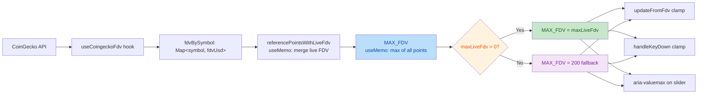

# Rate Calculation Reference

Frontend rate simulation documentation — consolidated from the former multi-file module docs.

## Module Map

| Module | Section |
|---|---|
| Native Aave rate math | [Part 1: Native Rate Simulation](#part-1-native-rate-simulation) |
| Merkl incentive forecast | [Part 2: Merkl Incentive Forecast](#part-2-merkl-incentive-forecast) |
| APR/APY display, USD/day, net eligibility | [Part 3: APR / APY Display Semantics](#part-3-apr--apy-display-semantics) |
| Incentive cap / ceiling reference | [Part 4: Incentive Reward Cap Reference](#part-4-incentive-reward-cap-reference) |
| Simulation null semantics & totalSupplyUsd | [Part 7: Simulation Null Semantics](#part-7-simulation-null-semantics) |

---

## Part 1: Native Rate Simulation

Source: `src/lib/interestRateCalculator.ts`.

This section covers the native Aave interest-rate math used for supply / borrow simulation.

### Terminology Mapping

| Term / Variable | Alias | Context | Description |
|-----------------|-------|---------|-------------|
| `liquidityRate` | `supplyRate` | Internal calculation | Aave protocol term for supplier yield |
| `supplyAprPercent` | — | Output/display | Same as `liquidityRate`, converted to % |
| `supplyApyPercent` | — | Output/display | `liquidityRate` with compounding, as % |
| `reserveFactor` | Protocol fee | Input parameter | Fee deducted from interest (bps, 0-10000) |
| `variableBorrowRate` | Borrow rate | Calculation | Interest rate charged to borrowers |

**Key relationship**: `liquidityRate` (internal) = `supplyAprPercent` (output)

### Constants

| Name | Value | Usage |
|------|-------|-------|
| RAY | 10^27 | Aave fixed-point precision |
| PERCENTAGE_FACTOR | 10000 | Basis points denominator |
| SECONDS_PER_YEAR | 31536000 | 365 × 24 × 60 × 60 |

### Input Fields (from `/markets` reserves — `ReserveWithSpread` rate calc fields)

| Field | Type | Unit | Description |
|-------|------|------|-------------|
| `availableLiquidity` | string (bigint) | token decimals | Available liquidity for borrowing |
| `totalVariableDebt` | string (bigint) | token decimals | Total variable debt (already index-normalized) |
| `deficit` | string (bigint) | token decimals | Reserve deficit from onchain/Aave API |
| `reserveFactor` | string (bigint) | bps | Protocol fee on interest |
| `optimalUsageRate` | string (bigint) | ray | Target utilization / kink |
| `baseVariableBorrowRate` | string (bigint) | ray | Minimum borrow rate |
| `variableRateSlope1` | string (bigint) | ray | Slope below kink |
| `variableRateSlope2` | string (bigint) | ray | Slope above kink |
| `decimals` | number | — | Token decimals for unit conversion |

### Calculation Steps

#### 1. Parse inputs and apply user actions

```text
totalVariableDebt = baseTotalVariableDebt + borrowAmount
```

`baseTotalVariableDebt` comes from `rateInput.totalVariableDebt` (already index-normalized).

#### 2. Compute usage rates

| Rate | Formula | Purpose |
|------|---------|---------|
| `borrowUsageRate` | `totalVariableDebt / (availableLiquidity + baseTotalVariableDebt + supplyAmount)` | Borrow rate and displayed utilization |
| `supplyUsageRate` | `totalVariableDebt / (availableLiquidity + baseTotalVariableDebt + deficit + supplyAmount)` | Liquidity rate, includes deficit |

```text
borrowUsageRate = rayDiv(totalVariableDebt, availableLiquidity + baseTotalVariableDebt + supplyAmount)
supplyUsageRate = rayDiv(totalVariableDebt, availableLiquidity + baseTotalVariableDebt + deficit + supplyAmount)
```

`rayDiv(a, b) = (a × RAY + b/2) / b`

#### 3. Compute variable borrow rate

If `borrowUsageRate ≤ optimalUsageRate`:

```text
normalizedUsage = rayDiv(borrowUsageRate, optimalUsageRate)
variableBorrowRate = baseVariableBorrowRate + rayMul(variableRateSlope1, normalizedUsage)
```

If `borrowUsageRate > optimalUsageRate`:

```text
excessRatio = rayDiv(borrowUsageRate - optimalUsageRate, RAY - optimalUsageRate)
variableBorrowRate = baseVariableBorrowRate + variableRateSlope1 + rayMul(variableRateSlope2, excessRatio)
```

#### 4. Compute liquidity rate

```text
liquidityRate = percentMul(rayMul(variableBorrowRate, supplyUsageRate), PERCENTAGE_FACTOR - reserveFactor)
```

`percentMul(v, pct) = (v × pct + 5000) / 10000`

#### 5. Convert APR to APY

```text
ratePerSecond = aprRay / SECONDS_PER_YEAR
apyRay = rayPow(RAY + ratePerSecond, SECONDS_PER_YEAR) - RAY
```

#### 6. Convert ray to percentage

```text
percent = Number(rayValue) / 1e25
```

### Output Structure

```typescript
interface NativeRateSimulation {
  utilizationRateRay: string
  utilizationRatePercent: number
  supplyAprPercent: number
  borrowAprPercent: number
  supplyApyPercent: number
  borrowApyPercent: number
  addedLiquidityRaw: string
  addedBorrowRaw: string
}
```

### Visual Model

```text
Borrow Rate
    │
    │                      ╱ slope2
    │                     ╱
    │                    ╱
    │           ╱───────•  kink at optimalUsageRate
    │          ╱ slope1
    │         ╱
    ├────────•  baseVariableBorrowRate
    │
    └──────────────────────────────► Utilization
```

### Debugging Checklist

| Check | How |
|-------|-----|
| Utilization mismatch | Compare `utilizationRatePercent` vs market `utilizationPct` |
| Rate mismatch | Verify slope params, reserveFactor values |
| Ray precision | Parse inputs as bigint, not Number |

### Borrow Availability Constraint

```text
Available to Borrow = min(Available Liquidity + Supply Input, Borrow Cap Remaining)
```

Where:

- Available Liquidity = `availableLiquidity` from `/markets` reserve (converted to USD)
- Supply Input = user supply input
- Borrow Cap Remaining = `borrowCapUsd - currentTotalBorrowedUsd`

| Constraint | When Active | UI Message |
|------------|-------------|------------|
| Borrow Cap | `borrowCapRemaining < availableLiquidity` | `limited by borrow cap` |
| Available Liquidity | `availableLiquidity < borrowCapRemaining` | `limited by available liquidity` |

The simulation hook caps borrow input to the effective limit and surfaces which constraint binds.

### V4-Aware Display Functions (V3 + V4)

Available liquidity, total borrowed, and reserve size displayed on the reserves table / row / mobile card use **V4-aware unified display functions** in `src/lib/scenarioSize.ts`. V3 and V4 share the same primary source (on-chain fields) but differ in fallback behavior.

#### Unified display functions

| Function | V3 behavior | V4 behavior |
|---|---|---|
| `getDisplayTotalBorrowedUsd(reserve, version)` | on-chain `totalVariableDebt` ?? `reserveSizeUsd × utilizationPct / 100` | on-chain `totalVariableDebt` only (no derived fallback) |
| `getDisplayAvailableLiquidityUsd(reserve, version)` | on-chain `availableLiquidity` ?? `reserveSizeUsd − totalBorrowedUsd` | on-chain `availableLiquidity` only (no derived fallback) |
| `getDisplayReserveSizeUsd(reserve, version, scenario?)` | `reserveSizeUsd` + scenario input | `reserveSizeUsd` only if > 0; `null` if 0 or missing |

**Key principle**: The difference is only in the fallback. V3 can safely fall back to `reserveSizeUsd`-derived calculations; V4 cannot, because `reserveSizeUsd` may be 0 or a per-Spoke slice.

#### Internal architecture

```
UI component (DesktopReserveRow / MobileReserveCard / ReservesTable)
  └→ getDisplayReserveSizeUsd(reserve, protocolVersion, scenarioInput?)
       ├→ [V4 gate] reserveSizeUsd === 0? → return null
       ├→ [no scenario input] → return reserveSizeUsd
       └→ getScenarioSupplySizeUsd({ reserveSizeUsd, supplyCapUsd, rawSupplyInput, ... })
            └→ reserveSizeUsd + supplyInputUsd (capped at supplyCapUsd)
```

- `getDisplayReserveSizeUsd` — **facade**: decides whether `reserveSizeUsd` is usable (V4: 0 → null), then delegates.
- `getScenarioSupplySizeUsd` — **engine**: pure arithmetic, adds scenario input to base value, respects supply cap. Version-agnostic.

#### On-chain computation (low-level helpers)

```text
totalBorrowedUsd = (Number(reserve.totalVariableDebt) / 10^reserve.decimals) × reserve.tokenPrice
availableLiquidityUsd = (Number(reserve.availableLiquidity) / 10^reserve.decimals) × reserve.tokenPrice
```

`getReserveTotalBorrowedUsd` and `getReserveAvailableLiquidityUsd` perform this computation and return `null` when any input is missing/invalid, allowing the unified functions to decide whether to fall back.

#### Why V4 cannot use derived fallbacks

For V4 markets, `reserveSizeUsd` and the on-chain fields describe **different aggregation levels**:

| Field | V3 meaning | V4 meaning |
|---|---|---|
| `reserveSizeUsd` | Total supplied USD for the asset in this market (matches the pool) | Total supplied USD for the asset **in this Spoke only** (per‑Spoke supply slice); can be 0 |
| `availableLiquidity` | Free liquidity in the pool (raw token units) | Free liquidity in the **Hub** for the asset (raw token units) — shared across Spokes |
| `totalVariableDebt` | Total variable debt in the pool (raw token units) | Total variable debt in the **Hub** for the asset (raw token units) |
| `utilizationPct` | `borrowed / reserveSize` for the pool | Hub‑level utilization for the asset |

Concrete example (snapshot 2026‑04‑27, AaveV4Bluechip USDT):

| Field | Value |
|---|---|
| `reserveSizeUsd` (Spoke `Bluechip` supply) | 0 |
| `totalVariableDebt` (Hub) | 1,037,279,054,299 raw ≈ $1,037,487 |
| `availableLiquidity` (Hub free) | 76,610,908,377 raw ≈ $76,626 |
| Derived `reserveSizeUsd × utilizationPct / 100` (wrong) | 0 |
| Derived `reserveSizeUsd − totalBorrowed` (wrong) | −$1,037,487 |

A single Hub aggregates supply from one or more Spokes; borrows are taken against the Hub's pooled liquidity. As a result `reserveSizeUsd` is a per‑Spoke supply ledger, while `availableLiquidity` / `totalVariableDebt` are Hub aggregates. Mixing them produces values that are off by orders of magnitude or even negative.

#### Additional V4-aware fixes

Beyond the three unified display functions, the following locations also have V4-specific handling for `reserveSizeUsd`:

| Location | What | V4 behavior |
|---|---|---|
| `useRateSimulation.ts` → `getMeritAnchorTvlUsd` | Merit incentive TVL anchor | Supply: `reserveSizeUsd` only if > 0, else `undefined`. Borrow: on-chain `totalVariableDebt` instead of `reserveSizeUsd × utilizationPct / 100`. |
| `useRateSimulation.ts` → `currentReserveSizeUsd` | Supply cap room calculation | `null` when `reserveSizeUsd` is 0 or missing (disables cap constraint). |
| `SimulationSubRow.tsx` → `currentSupplySizeUsd` | Supply cap exceeded check | `null` when `reserveSizeUsd` is 0 or missing (disables base-exceeded warning). |

#### Frontend requirements until API improvement

Until the API exposes a Hub‑level `reserveSizeUsd` (or a separate `hubSuppliedUsd`), the frontend must:

1. Use on-chain `availableLiquidity` and `totalVariableDebt` (raw → token → USD) as the canonical source for available liquidity and total borrowed.
2. Never fall back to `reserveSizeUsd`-derived calculations for V4 markets.
3. Avoid presenting `reserveSizeUsd` as "total supplied" for V4 without qualifying it as the per‑Spoke supply slice.
4. Keep simulation inputs aligned: `useRateSimulation` already feeds `availableLiquidity` into `interestRateCalculator`, so simulation outputs (`marketMetrics.availableLiquidityUsd*`) and the static base value share the same source of truth.

---

## Part 2: Merkl Incentive Forecast

Source: `src/lib/merklForecast.ts`.

This section covers `forecastWithTVL` and how Merkl forecast data plugs into simulation.

### How simulation connects

- User input is converted to USD for incentives (`supplyInputUsd` / `borrowInputUsd`).
- For a forecast row with a matching `campaignId`:

```text
hypotheticalTvl = max(0, latestTvl + inputUsd)
```

- If `inputUsd ≤ 0` or no forecast row exists, the UI keeps the current reserve Merkl APR.

`getMerklBreakdownApr` precedence:

1. `campaignApr > 0` → use directly
2. `pointsPerThousandUsd` present and positive → Tydro points formula (`points × pointToUsdRate × 36.5`)

`safePointToUsdRate` guard: `pointToUsdRate = 0` is **passed through** (user explicitly set $0/INK to zero out rewards); only NaN, Infinity, or negative values fall back to the default rate (1).
3. `DUTCH_AUCTION` → implied APR from `plannedDaily / latestTvl × 365 × 100`
   (points-to-USD conversion applied only when `pointsPerThousandUsd` field is present;
   non-points campaigns use neutral rate 1)
4. Return `0` (MAX/FIX capped fallbacks are handled by `forecastWithTVL`, not here)

### Dutch auction fallback rule

`DUTCH_AUCTION` uses a fallback APR from `plannedDaily / latestTvl` when `campaignApr` and Tydro points are both unusable.

- Scope: `campaignType === 'DUTCH_AUCTION'` only
- Inputs: `plannedDaily`, `latestTvl`
- Applies regardless of whether `pointsPerThousandUsd` field is present
- When the points field is present, `plannedDaily` is treated as points and converted to USD via `pointToUsdRate`
- When the points field is absent, `plannedDaily` is already in USD (neutral rate 1)
- Non-DUTCH campaign types do **not** use this fallback path; MAX/FIX rely on `forecastWithTVL`

### Symbols

| Symbol / field | Meaning |
|----------------|---------|
| `tvl` | USD eligible TVL passed into `forecastWithTVL` |
| `aprCap` | Annual APR as decimal fraction |
| `plannedDaily` / `requiredDaily` | Backend daily emission targets |
| `remainingBudget` | `max(0, totalBudget - distributedSoFar)` |

### Campaign type matrix

| `campaignType` | Forecast path | Uses `requiredDaily` from side-data? | Fallback when missing | Returned fields |
|----------------|---------------|--------------------------------------|-----------------------|-----------------|
| `DUTCH_AUCTION` | Planned-only | No | `plannedDaily` | `dailyRewards`, `apr`, `regime` |
| `MAX_REWARD_VALUE_PER_LIQUIDITY_VALUE` | Capped by APR, then catch-up via required daily emission | Yes | `plannedDaily` | `dailyRewards`, `apr`, `regime` |
| `FIX_REWARD_VALUE_PER_LIQUIDITY_VALUE` | Fixed APR budget path | No | N/A | `dailyRewards`, `apr`, `regime`, `fixRewardableDays`, `fixRewardableUntilTs` |

### FIX Mode Variables by Distribution Variant

FIX 模式的完整变量链，按 `distributionType` 区分单位。

#### 变量来源表

| 变量 | 来源 | VALUE (USD) | AMOUNT_PER_VALUE | AMOUNT_PER_AMOUNT |
|---|---|---|---|---|
| `campaign.amount` | Merkl API | raw tokens (有 price) | raw tokens (无 price) | raw tokens (无 price) |
| `totalBudget` | Backend | USD (amount × price) | reward tokens | reward tokens |
| `distributedSoFar` | Backend (metrics 累加) | USD | reward tokens (`totalInToken`) | reward tokens (`totalInToken`) |
| `aprCap` | Backend (`distributionSettings.apr`) | decimal (USD/USD/yr) | tokens/USD/yr | tokens/token/yr |
| `latestTvl` | Backend (metrics) | USD | USD | **无** (API 返回 0) |
| `plannedDaily` | Backend = `totalBudget / totalDays` | USD/day | tokens/day | tokens/day |
| `requiredDaily` | Backend = `remainingBudget / remainingDays` | USD/day | tokens/day | tokens/day |
| `remainingBudget` | Frontend = `totalBudget - distributedSoFar` | USD | tokens | tokens |
| `aprBasedDaily` | Frontend = `tvl × aprCap / 365` | USD/day | tokens/day ✅ | **无法计算** (tvl=0) |
| `dailyRewards` | Frontend = `min(aprBasedDaily, remainingBudget)` | USD/day | tokens/day | **0** |
| `apr` | Frontend = `dailyRewards × 365 / tvl` | 百分比 | tokens/USD/yr | **0** |
| `fixRewardableDays` | Frontend = `remainingBudget / aprBasedDaily` | days | days | **∞** (aprBasedDaily=0) |

#### 单位一致性验证

**AMOUNT_PER_VALUE**:
- `aprCap = 18.25 tokens/USD/yr`
- `tvl = USD`
- `aprBasedDaily = tvl(USD) × 18.25 / 365 = tokens/day` ✓
- `dailyRewards = min(tokens/day, tokens) = tokens/day` ✓
- `apr = tokens/day × 365 / tvl(USD) = tokens/USD/yr` ✓
- **结论**：单位链自洽，但 `apr` 不是百分比 USD APR

**AMOUNT_PER_AMOUNT**:
- `aprCap = 3650 tokens/token/yr`
- `tvl = 0` (API 无数据)
- `aprBasedDaily = 0 × 3650 / 365 = 0`
- `dailyRewards = 0`
- `apr = 0`
- **结论**：forecast 完全不可用

#### API vs Frontend 计算

| 变量 | 谁计算 | 公式 |
|---|---|---|
| `totalBudget` | Backend | `campaign.amount / 10^decimals × (price ?? 1)` |
| `distributedSoFar` | Backend | `sum(metrics.dailyRewardsRecords[].totalInToken)` for AMOUNT |
| `aprCap` | Backend | `distributionSettings.apr` (decimal) |
| `latestTvl` | Backend | `metrics.tvlRecords[].total` (VALUE) / `.totalInToken` (AMOUNT) |
| `plannedDaily` | Backend | `totalBudget / ((endTs - startTs) / 86400)` |
| `requiredDaily` | Backend | `(totalBudget - distributedSoFar) / remainingDays` |
| `remainingBudget` | Frontend | `totalBudget - distributedSoFar` |
| `aprBasedDaily` | Frontend | `tvl × aprCap / 365` |
| `dailyRewards` | Frontend | `min(aprBasedDaily, remainingBudget)` |
| `apr` | Frontend | `dailyRewards × 365 / tvl` |
| `fixRewardableDays` | Frontend | `remainingBudget / aprBasedDaily` |
| `fixRewardableUntilTs` | Frontend | `min(endTs, nowTs + fixRewardableDays × 86400)` |

#### AMOUNT 变体的 USD APR 问题

**AMOUNT 变体没有 USD APR 概念**（`rewardToken.price = null`）。当前代码路径：
1. Backend `campaignApr = distributionSettings.apr`（token 利率）
2. Frontend 显示为"百分比 APR"（错误）

**正确处理**：
1. Backend 尝试获取 `rewardToken.price`（已有 → 用；无 → CoinGecko）
2. 若无 price → `campaignApr = 0` + `campaignAprUnavailable = true`
3. 若有 price：
   - AMOUNT_PER_VALUE: `usdApr = tokenApr × price`
   - AMOUNT_PER_AMOUNT: `usdApr = tokenApr × rewardPrice / targetPrice`（需两个价格）
4. Frontend 检查 `campaignAprUnavailable` → em dash + tooltip

Current source wiring:

- `src/hooks/useRateSimulation.ts` and `src/components/dashboard/MerklForecastPanel.tsx` both merge `requiredDaily` from `/meta/side-data` into the forecast state.
- `src/lib/merklForecast.ts` still resolves `requiredDaily ?? plannedDaily` on the MAX path only.
- If `requiredDaily` is absent, the fallback is `plannedDaily`; if that is also missing, the safe value becomes `0`.
- `/markets` does **not** return `requiredDaily` for `DUTCH_AUCTION`; that campaign type uses the Dutch-auction fallback path only and does not depend on side-data.

### `campaignApr` 与 `plannedDaily + TVL` 的一致性核对

当你需要验证接口返回的 `campaignApr` 是否等于反推值时，请按**百分比点位**统一口径：

```text
impliedAprPercent = plannedDaily * 365 / tvl * 100
```

`campaignApr` 与 `impliedAprPercent` 的关系是**按 campaignType 分支**判断：

- `DUTCH_AUCTION`：
  - 理想情况 `campaignApr` 会等于 `impliedAprPercent`（或与它只差浮点噪声）。
  - 若 `campaignApr == 0` 且 `pointsPerThousandUsd` 字段存在（包括值为 `0`、无效值），则 points 语义仍保留，但 fallback 只在 Dutch auction 上启用。

- `MAX_REWARD_VALUE_PER_LIQUIDITY_VALUE`：
   - 不能直接用 `plannedDaily` 做反推。
   - 需要先按分支计算：
   ```text
   aprBasedDaily = (tvl * aprCap) / 365
   dailyRewards = min(requiredDaily, aprBasedDaily)
   campaignAprEff = (dailyRewards * 365) / tvl
   ```
   其中 `requiredDaily` 来自 side-data forecast state，缺失时回退为 `plannedDaily`。

- `FIX_REWARD_VALUE_PER_LIQUIDITY_VALUE`：
  - 不能直接用 `plannedDaily` 做反推。
  - 需先按分支计算：
  ```text
  aprBasedDaily = (tvl * aprCap) / 365
  dailyRewards = min(aprBasedDaily, remainingBudget)
  campaignAprEff = (dailyRewards * 365) / tvl
  ```

一个经验可复现结果（按当前快照）是：非零 `campaignApr` 中，主要偏差都发生在 MAX/FIX 分支；points 模式常见 `campaignApr=0`、`pointsPerThousandUsd>0` 且 `impliedAprPercent` 为正值，不应判定为异常。

### 结论速记（通用）

- `DUTCH_AUCTION` 可以用 `plannedDaily + latestTvl` 做 Dutch-auction fallback 对账。
- `MAX_REWARD_VALUE_PER_LIQUIDITY_VALUE` / `FIX_REWARD_VALUE_PER_LIQUIDITY_VALUE` 不能只用 `plannedDaily` 反推；必须走 capped 分支（`requiredDaily`、`aprCap`，以及 FIX 的 `remainingBudget`）。
- `campaignApr == 0` 且 `pointsPerThousandUsd` 字段存在时视为 points 模式；若字段值为 `0` / 无效，只有 `DUTCH_AUCTION` 继续走该 fallback。

### Session Notes (campaignApr reconciliation)

- 本次修复把 `pointsPerThousandUsd` 的"字段存在性"纳入分支判断，避免 `0` / 无效值被当成非 points 处理。
- `DUTCH_AUCTION` 的 fallback 只在 points 字段存在但值不可用时启用。
- 已新增真实 fixture 的回归测试，确保 Dutch-auction fallback 不会被其它 campaignType 复用。

### 对账输出建议（`campaignApr` vs `planned+TVL`）

建议把每条活动按以下三类输出，便于判断是否异常：

- `plain-match`
  - `campaignType` 为 `DUTCH_AUCTION`
  - 且 `|impliedAprPercent - campaignApr| <= tolerance`
  - 或者 `campaignApr == 0` + `pointsPerThousandUsd > 0` 且 `campaignApr` 被规则定义为 points 模式

- `capped-required`
  - `campaignType` 为 `MAX_REWARD_VALUE_PER_LIQUIDITY_VALUE` 或 `FIX_REWARD_VALUE_PER_LIQUIDITY_VALUE`
  - 需要用 `requiredDaily`/`aprCap`/`remainingBudget` 重建 `campaignAprEff`
  - 与 `campaignAprEff` 比较

- `needs-data-check`
  - 缺失关键字段：`latestTvl`、`requiredDaily`、`aprCap`、`totalBudget/distributedSoFar`
  - 或者 `tvl <= 0`

简化脚本输出样例：

```text
campaignId=... chain=... token=... side=... type=... category=plain-match | tol=0.0001
  campaignApr=1.05% | implied=1.0500% | diff=+0.0000pp

campaignId=... type=MAX_REWARD_VALUE_PER_LIQUIDITY_VALUE category=capped-required
  campaignApr=1.75% | projectedApr=1.78% | diff=+0.03pp | requiredDaily=... | aprCap=...

campaignId=... category=needs-data-check
  miss=latestTvl=0 or requiredDaily missing
```

用于你这次结论时：先看 `category`，再看 `type`。

### FIX branch

```text
aprBasedDaily  = (tvl × aprCap) / 365
dailyRewards   = aprBasedDaily
apr            = aprCap
```

APR 始终等于 `aprCap`，不会因 TVL 增大或预算不足而降低。预算能支撑多久由 `fixRewardableDays` 和 `fixRewardableUntilTs` 告知用户（UI 显示 `~Nd earn`，小于 1 天时用两位小数如 `~0.09d earn`）。

**FIX APR 不会稀释的依据**（Merkl 官方文档 `docs.merkl.xyz/merkl-mechanisms/distributions`）：
> Fixed Reward Rate — Campaign may finish earlier: Campaigns end when funds are depleted or when the scheduled duration expires. If a campaign runs out of funds before its end date, rewards are split proportionally (like a variable reward rate campaign) in the final run, then the campaign closes.

最后一轮按比例分配（proportional split）在数学上等价于"完整 APR 应用不足一天的有效时长"：每人的实际收益 = `aprCap × (fixRewardableDays / 365)`。因此 `fixRewardableDays` 精确表达了 Merkl 的行为——APR 不变，只是有效时长缩短。

### MAX / capped APR branch

```text
aprBasedDaily = (tvl × aprCap) / 365
dailyRewards   = min(requiredDaily, aprBasedDaily)
apr            = (dailyRewards × 365) / tvl
```

- `APR_CAPPED` means the cap binds.
- `CATCHING_UP` means required daily emission is above planned daily by tolerance.
- This branch does not multiply by `remainingBudget`.

### DUTCH_AUCTION

```text
dailyRewards = plannedDaily
apr = (dailyRewards × 365) / tvl
```

`DUTCH_AUCTION` does not use `requiredDaily` or APR-cap catch-up logic.

### Other non-FIX/MAX types

The current code does not apply a separate forecast branch to additional campaign types. They flow through the same MAX-style fallback path unless new handling is added.

### Edge case

If `tvl ≤ 0`, both `dailyRewards` and `apr` are `0`.

### Model APR to UI percentage

```text
forecastAprPercent = forecast.apr × 100 × multiplier
```

`multiplier` is `1` unless Tydro points are involved.

### Session Notes (Merkl forecast)

- Points campaigns now use field presence, not just `> 0`, to decide whether to enter points-aware handling.
- For real points fixtures, implied APR and traditional points APR should match after `plannedDaily -> USD` conversion.
- `latestTvl` stays in USD in the implied APR fallback; only `plannedDaily` is converted from points to USD.
- `src/lib/tydro.test.ts` includes a regression test that asserts the real fixture stays aligned across both formulas.

---

## Part 3: APR / APY Display Semantics

This section covers display-time behavior, cashflow semantics, and net-position eligibility.

### Native vs incentive rates

- Native Aave rates stay in APY in the UI.
- Incentive / forecast-derived rates follow the global APR/APY toggle.

### Incentive APR → APY conversion

```text
aprDecimal = aprPercent / 100
apyPercent = ((1 + aprDecimal / 12) ^ 12 - 1) × 100
```

Applied consistently to Merkl, Merit, Brevis, protocol incentive rows, and incentive totals.

### Total rate composition

- Supply total = `nativeSupplyApy + incentiveDisplayValue`
- Borrow total = `nativeBorrowApy - incentiveDisplayValue`

The toggle changes incentive contribution only, not the native base rate.

### Scenario USD/day (`scenarioUsdAccrual`)

Source: `src/hooks/useRateSimulation.ts` (`buildSupplyUsdAccrualSide`, `buildBorrowUsdAccrualSide`).

Each scenario side computes a daily USD cashflow from the **after-simulation** rates.

#### Supply side

```text
nativeUsdPerDay    = principalUsd × ((1 + nativeApyDecimal)^(1/365) − 1)    // Aave per-second APY → daily
incentiveUsdPerDay = principalUsd × incentiveAprPercent / 100 / 365          // APR-linear
totalUsdPerDay     = nativeUsdPerDay + incentiveUsdPerDay
```

Where `nativeApyDecimal` comes from `nativeAprPercentToApyPercent` (Aave per-second compounding: `(1 + apr / SECONDS_PER_YEAR)^SECONDS_PER_YEAR − 1`).

#### Borrow side

```text
nativeUsdPerDay    = −principalUsd × ((1 + nativeApyDecimal)^(1/365) − 1)   // negative (interest paid)
incentiveUsdPerDay =  principalUsd × incentiveAprPercent / 100 / 365          // positive (rebate)
totalUsdPerDay     = nativeUsdPerDay + incentiveUsdPerDay
```

#### Net USD/day

```text
netUsdPerDay = supplyTotalUsdPerDay + borrowTotalUsdPerDay
```

Supply is positive earnings; borrow native is negative cost; borrow incentive is positive rebate. `netUsdPerDay` is the combined daily cashflow for the position.

#### Type structure

```typescript
interface ScenarioUsdAccrualSide {
  nativeUsdPerDay: number | null;      // supply: positive; borrow: negative
  incentiveUsdPerDay: number | null;   // supply: positive; borrow: positive (rebate)
  totalUsdPerDay: number | null;       // native + incentive for this side
}

interface ScenarioUsdAccrual {
  supply: ScenarioUsdAccrualSide | null;
  borrow: ScenarioUsdAccrualSide | null;
  netUsdPerDay: number | null;         // supply total + borrow total
}
```

Present when at least one side has scenario principal; `null` otherwise.

#### Key invariant

Toggling APR/APY display mode must **not** change `scenarioUsdAccrual` outputs. Native daily USD uses Aave per-second compounding; incentive daily USD uses APR-linear dailyization. Both are independent of the display toggle.

#### UI consumption

| Component | File | Usage |
|-----------|------|-------|
| `SimulationSubRow` | `src/components/dashboard/SimulationSubRow.tsx` | Displays `netUsdPerDay` alongside per-side native/incentive breakdown |

### Net Position Eligibility (Scenario Simulation)

When both supply and borrow are present:

- Merkl and Merit use net position
- Brevis uses gross input

| Eligibility mode | Used by | Formula |
|------------------|---------|---------|
| Net | Merkl, Merit | `max(supply - borrow, 0)` / `max(borrow - supply, 0)` |
| Gross | Brevis | `supply` / `borrow` |

```text
eligibilityRatio = netInputUsd / grossInputUsd
effectiveAPR = poolForecastAPR × eligibilityRatio
```

Single-input scenarios keep `eligibilityRatio = 1`.

When `eligibilityRatio < 1`, rows show a net eligibility hint via `capNote`.

---

## Part 4: Incentive Cap Reference

This section groups cap semantics for Merit, Merkl, and Brevis.

### Naming layers

| Layer | Role | Examples |
|-------|------|----------|
| API | Backend field names stay stable | `positionCap` |
| Domain | Prefer `cap` vocabulary | `positionCapUsd`, `eligibleUsd` |
| UI | Stable row diagnostics | `capNote`, `capWarning` |

### Field mapping

| Source | Domain meaning | Notes |
|--------|----------------|-------|
| Brevis `positionCap` | Position cap | Keep API name; domain uses `positionCapUsd` |
| Merit `selfPositionCapUsd` | Position cap | Domain uses `positionCapUsd`; only eligible portion earns incentive |
| Simulation UI | Same diagnostics | Keep `cap*` props stable |

### Unified simulation `capNote` strings

| Incentive / branch | When shown | `capNote` pattern |
|--------------------|------------|-------------------|
| Merkl FIX | Scenario input exists and rewardable days resolved | `~Nd earn` |
| Merkl MAX | APR capped for low TVL | `APR capped for low TVL` |
| Brevis | Position cap exists | `Incentive on first $X` |
| Brevis (calendar) | No position cap, campaign has remaining days | `~Nd to end` (informational, not a cap) |
| Merit Self | Eligible deposit cap applies | `Incentive on first $Z` |
| Merit Base | Net note only | `Net eligible $X of $Y` |
| Merkl DUTCH_AUCTION | Net note only | `Net eligible $X of $Y` |

### Cap taxonomy

| Cap type | Scope | Mechanism | Source file |
|----------|-------|-----------|-------------|
| Pool budget | Pool-wide | `dailyRewards = min(aprBasedDaily, remainingBudget)` | `merklForecast.ts` |
| Position cap | Per-user | `eligibleUsd = min(deposit, positionCapUsd)` | `meritForecast.ts`, `rateSimulationCalculator.ts` |

### Brevis position cap

- `positionCap` is a **position cap** — only the first `$X` of deposit/debt earns incentive.
- `positionCapUsd` = API `positionCap`; `eligibleUsd = min(deposit, positionCapUsd)`.
- Effective APR: `nominalApr × eligibleUsd / deposit` (when cap binds, APR is diluted).
- Missing `endDate` degrades gracefully to nominal APR.
- Shared cap across supply/borrow requires the same `campaignId` and matching metadata.

### Merkl FIX reward cap

- `fixRewardableDays` and `fixRewardableUntilTs` come from remaining budget divided by daily rewards.
- This is a pool-level cap shared by all users.

### Merit Base / Merit Self

- Merit Base anchors to reserve TVL when available.
- Merit Self uses `positionCapUsd` as a position cap — only the first `positionCapUsd` of deposit earns incentive.
- Merit Base intentionally emits no per-row `capNote`.

### UI surfaces

- `IncentiveTooltip` keeps static context only.
- `SimulationSubRow` uses `capNote` / `capWarning` for per-campaign diagnostics.

---

## Related Files

- `src/lib/interestRateCalculator.ts` – Core native rate calculation functions
- `src/lib/merklForecast.ts` – Merkl + Brevis unified `forecastWithTVL` and progress flags
- `src/lib/meritForecast.ts` – Merit forecast (base + self position cap)
- `src/lib/incentiveCaps.ts` – Domain-layer cap effects → simulation `capNote` / `capWarning`
- `src/lib/tydro.ts` – Tydro points-to-USD conversion
- `src/hooks/useRateSimulation.ts` – React hook: native simulation + incentive forecast overlay; `buildSupplyUsdAccrualSide` / `buildBorrowUsdAccrualSide` for USD/day
- `src/lib/portfolioSimulator.ts` – Portfolio mode: groups positions by reserve, calls buildRateSimulationResult per group with supply+borrow USD, Hub aggregation, fallback to static APY
- `src/hooks/reserves-table/usePortfolioToggle.ts` – Portfolio toggle handler; optional `simulationContext` param bridges full rate simulation into portfolio mode; fallback uses reserve.supplyApy/borrowApy + sum incentives
- `src/lib/formatters.ts` – Display formatting; `annualPercentToDailyFraction` (APY compound vs APR-linear dailyization)
- `docs/frontend-data-loading-matrix.md` – Data loading architecture
- `docs/design/frontend-interaction-guardrails.md` – Interaction design guardrails

---

## Part 5: Portfolio Mode Rate Simulation

Source: `src/lib/portfolioSimulator.ts`

Portfolio mode (Portfolio toggle) computes per-position APR by reusing the same `buildRateSimulationResult` pipeline as single-reserve simulation, with supply+borrow on the same reserve **grouped** into a single call.

### Grouping

Positions are grouped by `getReserveKey(reserve)` (= `reserveId.trim()`). Same-reserve supply + borrow positions are merged; same side positions have their USD amounts summed.

### Per-group simulation

For each group:

1. **deep-copy**: `reserveRateInput = hasRateCalcFields(reserve) ? { ...reserve } : null`
2. **Hub aggregation** (v4): if `reserve.hubId`, lookup `hubAggregationMap.get(getHubAssetKey(reserve))` and overwrite `reserveRateInput.borrowed`, `.hubBorrowed`, `.hubSupplied`
3. **Call `buildRateSimulationResult`** with `supplyInput = String(supplyUsd)`, `borrowInput = String(borrowUsd)`, `inputMode: 'usd'`, `meritMerklNetPosition` defaults to `true`
4. **Extract per-position APR**: `afterNative ?? currentNative ?? reserve.supplyApy ?? 0` (supply) / analogous for borrow; `afterIncentive ?? currentIncentive ?? 0`
5. **Build `PortfolioPositionResult`** via `buildPortfolioPositionResult`

### Fallback (simplified calculation)

When `simulationContext` is not provided, or a reserve lacks rate calc fields:

- `nativePercent = reserve.supplyApy / borrowApy` (backend static value)
- `incentivePercent = sum(reserve.supplyIncentives / borrowIncentives)` (raw array sum, no forecast)

This matches the pre-Phase-2 behavior exactly.

### `simulationContext` fields

| Field | Source | Role |
|-------|--------|------|
| `isApy` | AprApyToggle | APY compounding vs APR display |
| `whitelistMerklCampaignIds` | scenario strip | Merkl whitelist-only campaign opt-in |
| `tydroPointToUsdRate` | side-data | Tydro points→USD conversion |
| `forecastStates` | side-data | Merkl 10-min metrics for forecast |

### Hub aggregation in Portfolio

Same semantics as single-reserve `useSharedRateSimulations`: `hubBorrowed`/`hubSupplied` replace per-Spoke `borrowed`/`supplied` on the deep-copy, affecting both `simulateNativeRatesAfterActions` (utilization denominator) and `getMeritAnchorTvlUsd` (Merit anchor TVL). Multiple positions on the same reserve share one Hub-overwritten `reserveRateInput`, so no double-counting.

---

## Part 6: Ink Price Reference (FDV-Based)

Source: `src/components/dashboard/InkAprCalculator.tsx`, `src/hooks/useCoingeckoFdv.ts`.

The Ink APR calculator uses a FDV-based price model: the user estimates INK token FDV in billions USD, and the calculator derives a token price from `FDV / TOTAL_SUPPLY`. A slider with CEX benchmark reference points provides visual context.

### Price Derivation

```text
tokenPrice = (FDV_billions × 10^9) / TOTAL_SUPPLY
```

Where `TOTAL_SUPPLY = 1_000_000_000` (1B INK tokens).

### MAX_FDV: Dynamic from CoinGecko Reference Points

`MAX_FDV` is the slider endpoint and input clamp ceiling. It is derived dynamically from live CoinGecko data, not hardcoded.

**Data Flow:**



**Technical Call Chain:**

```mermaid
sequenceDiagram
    participant Component as InkAprCalculator
    participant Hook as useCoingeckoFdv
    participant Memo1 as referencePointsWithLiveFdv
    participant Memo2 as MAX_FDV useMemo
    Component->>Hook: fdvBySymbol
    Note over Hook: Returns Map&lt;symbol, fdvUsd&gt;
    Hook-->>Memo1: live FDV data
    Memo1->>Memo1: Merge live FDV into REFERENCE_POINTS
    Memo1-->>Memo2: referencePointsWithLiveFdv
    Memo2->>Memo2: Reduce: max of all point fdvs
    alt Has live data
        Memo2-->>Component: MAX_FDV = maxLiveFdv (e.g. 120)
    else No live data
        Memo2-->>Component: MAX_FDV = 200 (fallback)
    end
    Component->>Component: updateFromFdv / handleKeyDown<br/>use Math.min(MAX_FDV, value)
```

### Design Decisions

| Decision | Rationale |
|----------|-----------|
| MAX_FDV = max of all reference point live FDVs | Slider endpoint and input clamp always in sync. No distinction between full/partial availability — as long as at least one live FDV exists, use the max. |
| Fallback = 200 (billions) | When no live CoinGecko data at all. Conservative ceiling above typical CEX FDVs. |
| No input limit when no data | If all reference points return null, the fallback 200 serves as the slider endpoint and input clamp. The slider and input are always unified. |
| `useMemo` dependency on `referencePointsWithLiveFdv` | Automatically recomputes when CoinGecko data updates. Dependency chain: `fdvBySymbol` → `referencePointsWithLiveFdv` → `MAX_FDV`. |

### Reference Points

`REFERENCE_POINTS` is a hardcoded array of CEX benchmark tokens with their FDV values and slider positions:

| Token | Exchange | Hardcoded FDV (B) | Position | Live Source |
|-------|----------|-------------------|----------|-------------|
| GT | Gate | 1.0 | 0 | CoinGecko |
| OKB | OKX | 2.1 | 3 | CoinGecko |
| BGB | Bitget | 4.5 | 8 | CoinGecko |
| MNT | Mantle | 5.0 | 10 | CoinGecko |
| CRO | Crypto.com | 8.5 | 25 | CoinGecko |
| BNB | Binance | 115.8 | 100 | CoinGecko |

Each reference point's `fdv` is replaced by live CoinGecko data when available. The `default` point (fdv=1.0, isDefault=true) is never replaced — it acts as a floor ensuring `maxLiveFdv > 0` always holds.

### CoinGecko Integration

Source: `src/hooks/useCoingeckoFdv.ts`.

- Uses React Query with staleTime and cache persistence.
- Fetches FDV data for a predefined list of token IDs.
- Returns `fdvBySymbol: Map<string, number>` (symbol → fdvUsd).
- `InkAprCalculator` calls `useCoingeckoFdv()` and passes `fdvBySymbol` to `referencePointsWithLiveFdv`.

### Input Behavior

The FDV input uses `useDebouncedInput` (300ms debounce, 2 decimal places). On commit:

```text
clampedFdv = Math.max(MIN_FDV, Math.min(MAX_FDV, parsedFdv))
tokenPrice = (clampedFdv × 1e9) / TOTAL_SUPPLY
setRateInput(tokenPrice.toFixed(4))
```

- `MIN_FDV = 0` (zero FDV = zero price)
- `MAX_FDV` = dynamic from reference points (see above)
- Slider interaction uses `sliderActiveRef` guard to prevent blur events from overwriting slider updates

### FDV vs Simulation Input Behavioral Differences

Both FDV input and simulation input use `useDebouncedInput` (300ms debounce) but differ in control mode, external correction, and UI components due to different business requirements.

| | FDV input | Simulation input |
|---|---|---|
| File | `InkAprCalculator.tsx` | `ScenarioControls.tsx` |
| Hook | `useDebouncedInput` | `useDebouncedInput` |
| Debounce | 300ms | 300ms |
| Value source | Direct `value` prop (derived from `rateInput`) | `externalSupplyValue` state (initial `undefined`) |
| External correction | None (clamp in onCommit) | `ref.setSupplyInput` via `useImperativeHandle` |
| Slider | `sliderActiveRef` guard | None |
| UI component | shadcn `Input` | Native `<input>` |
| Decimal limit | 2 places | None |
| Reason | Bounded value 0–MAX_FDV, no external correction needed | External imperative write-back for corrected values |

#### 1. Direct value prop vs externalSupplyValue

- **FDV**: `value` always derives from `currentFdvBillions` (i.e. `rateInput`), always controlled mode. The "true value" lives in parent `rateInput`; `useDebouncedInput` is purely the display/edit layer.
- **Simulation**: `externalSupplyValue` starts as `undefined`. When `undefined`, the hook enters uncontrolled mode (free user input). When external correction is needed (e.g. max button, shared scenario switch), `ref.setSupplyInput` sets a value making it controlled; on next onCommit, `setExternalSupplyValue(undefined)` returns to uncontrolled.
- **Why this difference**: FDV's value source is deterministic (rateInput → currentFdvBillions), no external correction needed. Simulation can be imperatively modified by various external operations (max, shared scenario, mode switch), requiring `useImperativeHandle` to expose `setSupplyInput`/`setBorrowInput`.

#### 2. shadcn Input vs native input

shadcn `Input` is a native `<input>` wrapper with Tailwind style tokens (border, focus ring, padding). Both are functionally equivalent — same standard props (`ref`, `value`, `onChange`, `onBlur`, `onFocus`, `onKeyDown`). FDV uses shadcn for design-system styles (`disableSurface`, `cnDsInputNeutralWell`); Simulation uses native for historical reasons. Switching has no functional difference.

#### 3. Slider guard (sliderActiveRef)

Only FDV has a slider. During drag, mousedown triggers `updateFromFdv` → `setRateInput` → `currentFdvBillions` changes → `value` prop changes → `useDebouncedInput` syncs to `displayValue`. But during drag, `handleBlur` also fires (input loses focus), and `doCommit` would overwrite the slider update. `sliderActiveRef` checks at onCommit start — if slider is active, skip the commit.

#### 4. Shared core logic

All numeric inputs use `useDebouncedInput`, sharing:

- `sanitizeNumberInput` (CJK full-width decimal normalization, illegal character filtering)
- `formatNumberInput` (real-time thousands separator formatting)
- `computeCursorAfterFormat` (cursor position after formatting)
- `pendingCursorRef` + `useLayoutEffect` (cursor restoration after re-render)
- `maxDecimalPlaces` (optional; FDV uses 2)

**Conclusion**: Core logic is unified in `useDebouncedInput`. FDV and Simulation differences are driven by business requirements (bounded slider vs unbounded input + external correction), not code duplication — no further unification needed.

### Related Files

- `src/components/dashboard/InkAprCalculator.tsx` — Calculator component with FDV slider and input
- `src/hooks/useCoingeckoFdv.ts` — CoinGecko FDV data fetching hook
- `src/hooks/useDebouncedInput.ts` — Debounced controlled input hook (shared with simulation inputs)
- `src/lib/numberFormat.ts` — `sanitizeNumberInput` with `maxDecimalPlaces` parameter

---

## Part 7: Simulation Null Semantics

Consolidated from AAV-761 handoff docs. Covers `after`/`delta` null semantics, `hasInput` guard architecture, `totalSupplyUsd` naming, and calculator fallback contracts.

### 7.1 `after=0` vs `after=null` — `??` Operator Pitfall

| Value | `?? fallback` result | Semantics |
|---|---|---|
| `0` | `0` (no fallback) | "Simulated, result is 0%" |
| `null` | `fallback` | "Not simulated, use current" |

**Rule**: When `hasInput=false`, `after` must be `null` (not `0`). Applies to all `SimulationLane` after/delta fields and per-campaign detail rows.

Source: `src/lib/rateSimulationCalculator.ts`, `src/lib/portfolioSimulator.ts`.

### 7.2 Two-Layer Guard Architecture

| Layer | Guard | Purpose |
|---|---|---|
| Aggregate (6 places) | `hasAnyInput` | Preserve cross-side influence (e.g. Brevis shared cap where borrow input affects supply after) |
| Lane / display | per-side `hasInput` | Em dash for sides without input — `null` means "not simulated" |

**Why not per-side everywhere**: Per-side guards at aggregate layer cut cross-side influence. Commit `d1cbfe1c` reverted 6 aggregate guards from per-side back to `hasAnyInput` after regression.

**Native vs Incentive asymmetry**: Native after has no `hasInput` guard (native rate driven by utilization, not user position). Incentive after has per-side guard (incentive depends on user position). This is intentional.

### 7.3 `totalSupplyUsd` Semantics

| Term | Definition | Source |
|---|---|---|
| `totalSupplyUsd` | Total position = wallet + delta | `perReserveInputs` Map (portfolio mode) |
| `supplyNetInputUsd` | Net delta = max(supplyInput - borrowInput, 0) | Always from simulation input |
| `totalPositionUsd` | **= `totalSupplyUsd`** (no addition) | If you add `netInputUsd` again → double-count |

**Key formula**: `totalPositionUsd = totalSupplyUsd` (direct use, no addition). Because `total` already includes delta.

**Renaming history**: `principalSupplyUsd` → `totalSupplyUsd` (AAV-761). Old name "principal" implied "existing capital (excl. delta)" but value was wallet+delta. New name "total" is self-documenting.

**`reservePositions` → `crossReservePositions`** (8 files): Old name implied "positions" but stored simulation inputs in single-simulation mode. New name describes purpose (cross-reserve eligibility) without implying content.

### 7.4 Calculator Fallback Contract

`buildRateSimulationResult` does **no** `??` fallback on `totalSupplyUsd`/`totalBorrowUsd`. Caller (`useSharedRateSimulations`) provides correct values:

| Mode | `totalSupplyUsd` | `totalBorrowUsd` |
|---|---|---|
| Portfolio | wallet + delta (from `perReserveInputs`) | wallet + delta |
| Single simulation | `undefined` (fallback to `supplyInputUsd` in caller) | `undefined` |
| No input | `undefined` | `undefined` |

JSDoc on `buildRateSimulationResult` lists three caller contracts explicitly.

### 7.5 Brevis Position Cap vs Merit Self Position Cap

**Brevis `positionCap`** limits cumulative USD reward total, not position size. **Merit `selfPositionCapUsd`** limits position size. These are fundamentally different cap mechanisms. Brevis does **not** need `totalSupplyUsd` — denominator uses incremental `depositUsd`. Adding `totalPositionUsd` to Brevis would incorrectly apply Merit's position-cap logic.

### 7.6 Wallet-Only Incentive Delta

`buildIncentiveCurrent` accepts `walletSupplyUsd`/`walletBorrowUsd` (wallet position) separate from `depositUsd` (simulation input). When wallet exists but no manual input:

- `walletSupplyUsd` > 0 → Merit self-cap dilution still computed → `currentIncentive` is diluted value
- `deltaIncentive = currentIncentive - headlineIncentive` (typically negative, showing dilution)
- Without `walletSupplyUsd`: `currentIncentive = headlineIncentive` → `deltaIncentive = 0` → filtered by `formatDeltaPercent` threshold → delta not displayed

**Wallet derivation**: Portfolio mode: `wallet = totalSupplyUsd - supplyInputUsd`. Single simulation: wallet undefined (no `totalSupplyUsd`).

**`portfolioSimulator.ts` must not skip wallet-only positions**: `buildGroupMapFromSlots` and `buildPerReserveInputsFromEntries` check both `hasWalletPosition` and `hasUserInput` — skip only when both are absent. When only wallet: `effectiveAmountUsd = walletValue`, `deltaUsd = 0`.

### 7.7 Per-Campaign Detail Row

`buildMeritCampaignDetails`, `buildMerklCampaignDetails`, `buildBrevisCampaignDetails` all use `let after = null` initial declaration + explicit `else if (hasAnyInput) { after = null; }` branch. Brevis was missing this branch initially (AAV-771) — functionally correct due to initial `null`, but explicit branch is more defensive.

### 7.8 `SimulationLane` Field Names

`SimulationLane` has no `after`/`delta` fields. Only: `afterTotal`/`deltaTotal`, `afterNative`/`deltaNative`, `afterIncentive`/`deltaIncentive`.
